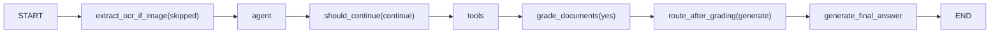
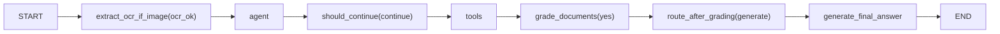

Generated at: 2026-03-29T14:13:06

## 1. Example 1 - Text (PTTT)
- Query: cách in pttt báo cáo theo tháng
- HTTP: 200
- Ticket: 19135
- Trace ID: 483880d3
- Answer preview: Để in báo cáo phẫu thuật, thủ thuật theo tháng, bạn thực hiện các bước sau:  1. Truy cập vào module chuyên khoa. 2. Chọn chức năng "in". 3. Từ danh sách hiển thị, chọn "phẫu thuật, thủ thuật". 4. Chọn

Flow steps:
1. extract_ocr_if_image(skipped)
2. agent
3. should_continue(continue)
4. tools
5. grade_documents(yes)
6. route_after_grading(generate)
7. generate_final_answer

## 2. Example 2 - Text (Gộp mã BN)
- Query: giờ mình muốn gộp mã bệnh nhân
- HTTP: 200
- Ticket: 19086
- Trace ID: d3117411
- Answer preview: Để gộp mã bệnh nhân trong module đón tiếp, bạn hãy thực hiện theo các bước sau:  1. Truy cập vào danh sách bệnh nhân. 2. Tìm kiếm tên của bệnh nhân cần gộp. 3. Chọn bệnh nhân cần gộp. 4. Chọn mã bệnh 

Flow steps:
1. extract_ocr_if_image(skipped)
2. agent
3. should_continue(continue)
4. tools
5. grade_documents(yes)
6. route_after_grading(generate)
7. generate_final_answer

## 3. Example 3 - Image OCR (E3)
- Query: lỗi này là sao ạ
- HTTP: 200
- Ticket: 17895
- Trace ID: e1ded973
- Answer preview: Dựa trên thông báo lỗi bạn gặp phải khi đăng nhập vào phần mềm EHC với mã lỗi E3, tôi có một số hướng khắc phục như sau:  1. Kiểm tra kết nối mạng internet:    - Đảm bảo máy tính của bạn đã kết nối đế

Flow steps:
1. extract_ocr_if_image(ocr_ok)
2. agent
3. should_continue(continue)
4. tools
5. grade_documents(yes)
6. route_after_grading(generate)
7. generate_final_answer

